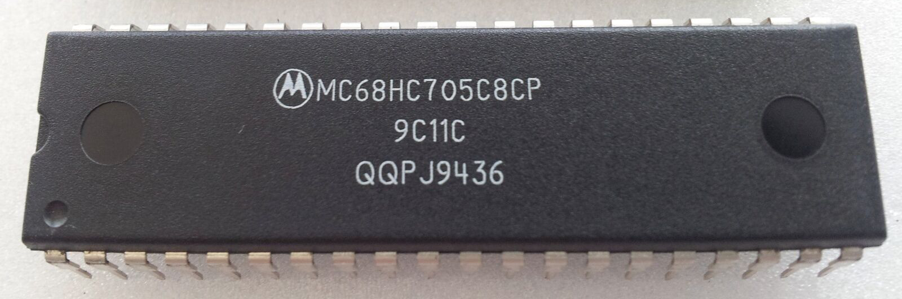

# PROG05
## _A modern (21st century) programmer for the ancient Motorola MC68HC705C8_

This application allows anyone to program, test, verify and run small applications on the 'C8' variant of the Motorola MC68HC705 series.
## Features

- It will work with the standard HC05 programmer board as described in the Motorola literature
- It will also work with the PROG05 board from Midon Design (http://midondesign.com/PROG05/PROG05.html)
- Programs OTP and EPROM versions of the chip and allows readback of unsecured chips
- Written in Golang, which means it can be built for Windows, Linux and macOS
- Works well with USB-to-SERIAL devices (CP2102, FT232 series, etc)
- Also allows use of my own custom programmer board where control of Vpp and RESET are automated (TBA)

Note this project is under development, not all features are available yet!
## Development and Building

PROG05 is developed using JetBrains GoLand with the latest Go runtime installed. Currently this is 1.19.3

It is built by simply using ```go build main.go``` on the command line in the root directory of the project.

## How it works
This software works by using a specific feature of the HC05 microcontroller. 
Every HC05 MCU contains a factory programmed bootloader that is invoked by:
- Applying 9.4V on the IRQ pin[^1] 
- Applying appropriate logic levels on port pins PD5 thru PD2
- Asserting RESET. 
If these conditions are present, when the HC05 comes out of reset it will begin execution of the
said bootloader. One of the modes of this bootloader is the ability to load small programs into RAM via the SCI module
and execute them.

I use this feature to perform every available function in this application. So for example, to read a memory location
in the HC05 address space, a small app is loaded into RAM, executed, and this application then interacts with this app
to perform the read by supplying the 16-bit address and then receiving the byte read, all via the serial port.
(any decent USB-to-serial converter)

All the 'applets' are written in assembly language and assembled with CASM05Z. The resultant S-record files are located
in the ```srec``` directory

[^1]: Actually this was never described in any of the documentation. I figured it out eventually because I remembered the HC908 series 
requires 7.2V to invoke the Monitor ROM and Motorola re-used a lot of concepts.


## Dependencies

PROG05 uses the following libraries which need to be installed using ``go get``, either manually or via the IDE
- Serial Port Library go.bug.st (https://pkg.go.dev/go.bug.st/serial)
- GoInfo Library (github.com/matishsiao/goInfo)

## Usage
This program uses a configuration file **(config.json)** to tell it about your environment at runtime. This is briefly described below.
A typical view of the configuration file is shown for reference:
```
{
	"port": "COM3",
    "targetclock": "4MHz"
}
```
```port``` - specifies which serial port to use (Windows: COMx, Linux: /dev/ttyUSBx, macOS: /dev/tty.<hardware-specific-name>)
	
```targetclock``` - specifies the frequency in use to clock the MCU. The original Motorola board uses a 2MHz clock. Similarly the MIDON board also uses a 2MHz clock. A 4MHz clock may also be used for faster programming. Always check the crystal/resonator frequency fitted to your board in case of doubt!

## Microcontroller Documentation
Due to the legacy of Motorola being a difficult company, and also the fact that during the HC05 era my country was under US sanctions, the documentation of this processor has been hard to come by, more so for me than everyone else. Thanks to contributions made to bitsavers.org the documents are now available. Documents (datasheets, errata, etc) are stored in a subdirectory called ```docs``` in the project

## Binaries
Coming soon.
My main machine is a Windows 10 box, so most of my releases will be for Windows 10 22H2 or above.
At any rate it is ridiculously easy to recompile this program from source for your desired platform. Just be aware
that for Linux and macOS platforms you would need to run this program with escalated user privileges i.e. as sudo

## Your Contribution?

Want to contribute? Great!
Find me on Mastodon (sonic2k at oldbytes.space) or here

## License

This program is published under the terms of the GNU General Public License
